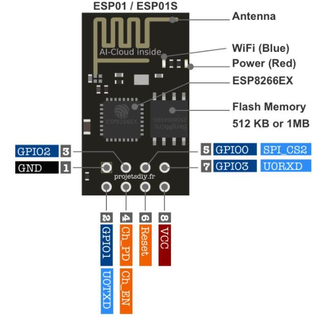

# UCES_project

## Parts

### Meeple

#### Hardware

-   ESP-01 (ESP8266)
-   ESP-01 Programmer module
-   ESP-01 Bredboard adapter
-   Mini bredboard
-   Hall sensor (A3144)
-   Resistors
-   LED
-   Set of wires

### Operation base

#### Hardware

-   ESP-32
-   LCD Display
-   I2C - LCD Adapter
-   Buzzer
-   Push button
-   Resistors
-   Set of wires
-   Large bredboard

